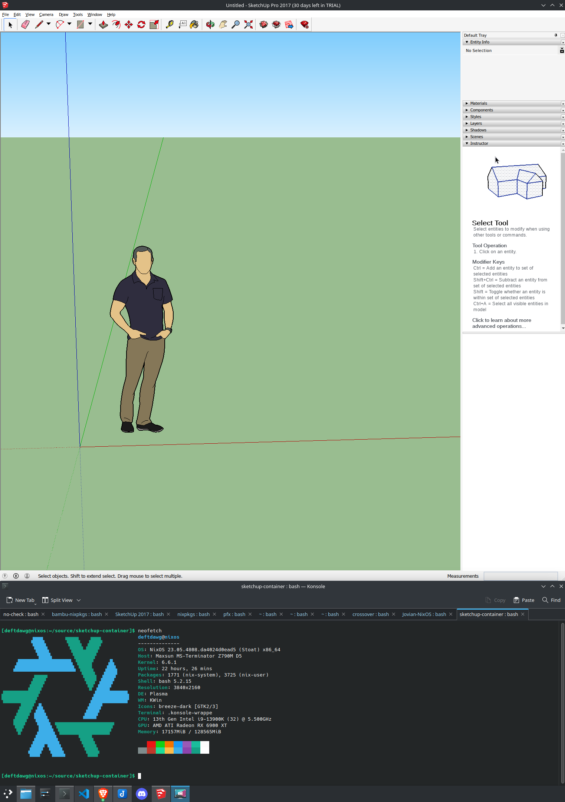

# DeftDawg's Containerized SketchUp Make 2017

Based on sketchup-container projects by @adelton (Jan Pazdziora) - Fedora/Docker and @tbultel (Thierry Bultel) - Ubuntu/Docker

This solution uses rootless Podman to install SketchUp Make 2017 into a container and then run it, allowing this old windows software to run on Linux (and possibly MacOS).  The Dockerfile has essentially been completely rewritten.

Before working on this solution, I attempted to get SketchUp Make 2017 running via Proton and 
while it does install & run at low resolution under SteamOS mode (inside pressure vessel), 
it tries to open at native resolution, fails to render the OpenGL part of the main window & crashes when launched from Steam Linux on 
Desktop, the same failure occurs on Codeweaver's CrossOver for Linux.

## Screenshot - Running on Rootless Podman on NixOS Linux

 

## Building

```sh
podman build --ulimit nofile=32767 --net=host --ipc=host --pid=host -t sketchup .
```

## Running

### Normal
```sh

# FIXME make this only apply -v ${DEVICE}:${DEVICE} if spacemouse found
DEVICE=/dev/input/$(grep "3Dconnexion" -A10 /proc/bus/input/devices | grep Handlers | grep -oE "event[^ ]*" | head -1)

podman run -v ${DEVICE}:${DEVICE} --userns=keep-id --network=host --ipc=host --pid=host --tmpfs /tmp -v /tmp/.wine-$(id -u) -e DISPLAY=$DISPLAY --security-opt=label:type:spc_t --user=$(id -u):$(id -g) -v /tmp/.X11-unix/X0:/tmp/.X11-unix/X0 -v ${HOME}:/data:Z --rm localhost/sketchup
```

### Debug w/ a terminal
```sh

# FIXME make this only apply -v ${DEVICE}:${DEVICE} if spacemouse found
DEVICE=/dev/input/$(grep "3Dconnexion" -A10 /proc/bus/input/devices | grep Handlers | grep -oE "event[^ ]*" | head -1)

podman run --entrypoint run-xterm -v ${DEVICE}:${DEVICE} --userns=keep-id --network=host --ipc=host --pid=host --tmpfs /tmp -v /tmp/.wine-$(id -u) -e DISPLAY=$DISPLAY --security-opt=label:type:spc_t --user=$(id -u):$(id -g) -v /tmp/.X11-unix/X0:/tmp/.X11-unix/X0 -v ${HOME}:/data:Z --rm localhost/sketchup
```

## Podman Building Challenges
### Low open file ulimit
99% of install runs under podman will fail when ulimit -n is `1024` at the .NET install step with:
```
0600:err:winediag:NtCreateFile Too many open files, ulimit -n probably needs to be increased
```

To overcome this we make sure the podman host has/allows a higher ulimit and provide `--ulimit` to podman's `build` command with a higher ulimit value
```sh
podman build --ulimit nofile=32767 ...
```

### Podman's consumption of disk space

This container which is approximately 8GB as an exported tarball, when it builds cleanly requires approximately 106GB of disk space to create.

Podman uses a ridiculous amount of disk space creating layers, failed builds leave behind garbage and interrupted builds leave behind hard to clean containers (https://github.com/containers/podman/issues/14523), hopefully these are areas podman can improve upon.

In the meantime, I've taken the following steps to wipe out all podman containers on my system when disk gets low or I finally have a working container build (I'll wipe and rebuild):

```sh
## These are commented out, run these only if you're sure you want to nuke *everything* podman
## Need to use builah to delete external containers... per podman #14523
nix-shell -p buildah # Install buildah on nixos temporarily
# podman system reset -f
# buildah containers --quiet | xargs -r buildah rm; buildah images --quiet | xargs -r buildah rmi -f
```

## Containerized SketchUp TODO
- [ ] Add documentation on using SketchUp Plugins (place them in `${HOME}/SketchUp\ Plugins`)
- [ ] Add [3Dconnexion SpaceMouse for Wine/Linux](https://github.com/DD1984/SpaceMouse_Fusion360_Wine) using [spacenavd](https://github.com/FreeSpacenav/spacenavd)

# Original README by @adelton (Jan Pazdziora) and @tbultel (Thierry Bultel) 
```
Run SketchUp Make in container
==============================

Running SketchUp on Linux requires installation of Wine. That can
certainly be done as it is packaged for example for Fedora but
I prefer to keep my core workstation installation free of software
that I only use from time to time or which I only use for specific
purpose.

This repository helps me to run SketchUp Make 2017 from container
image, installed separately from by workstation packages.

The original version of this container was based on Fedora,
but latest wine version for Ubuntu give better results, and less 
installation steps

Build image
-----------

This repository does not distribute the actual SketchUp Make binary.
It will be downloaded at the time the container is built.

	xhost +
	docker build --network=host --build-arg=uid=$(id -u) -t sketchup .

Run the container
-----------------

The container image expects the directory with .skp files bind-mounted
to /data directory in the container. This is an example command to
run the container, mounting the user home directory:

	docker run \
		--read-only \
		--network=host \
		--tmpfs /tmp -v /tmp/.wine-$(id -u) \
		-e DISPLAY=$DISPLAY \
		--security-opt=label:type:spc_t --user=$(id -u):$(id -g) \
		-v /tmp/.X11-unix/X0:/tmp/.X11-unix/X0 \
		-v $HOME:/data --rm sketchup

Installing the STL extension
-----------------

The container comes with slightly modified STL extension to Sketchup.
Namely the STL export does not work with wine, and I had to cheat a little bit.

It is not installed automagically, but the extension package *sketchup-stl.rbz*
is present on the Desktop directory of the wine user, making it straightforward
to install in Sketchup through the Extension Manager
```